<h1 align="center">
UniSHARP:<br>
Universal Sharp Monocular View Synthesis
</h1>

<p align="center">
  <b>Meixi Song</b><sup>1</sup> ·
  <b>Dizhe Zhang</b><sup>1,*</sup> ·
  <b>Hao Ren</b><sup>1,2</sup> ·
  <b>Ruiyang Zhang</b><sup>1,3</sup> ·
  <b>Bo Du</b><sup>4</sup> ·
  <b>Ming-Hsuan Yang</b><sup>5</sup> ·
  <b>Lu Qi</b><sup>1,4,*</sup>
  <br>
  <sup>1</sup>Insta360 Research · <sup>2</sup>Sun Yat-sen University · <sup>3</sup>Beihang University · <sup>4</sup>Wuhan University · <sup>5</sup>University of California, Merced
</p>

<p align="center">
  
  <a href="https://insta360-research-team.github.io/Unisharp-website/"></a>
  <a href="https://huggingface.co/spaces/Insta360-Research/UniSHARP"></a>
  <a href="https://huggingface.co/datasets/Insta360-Research/OmniRooms"></a>
</p>

UniSHARP extends SHARP-style photorealistic monocular view synthesis to universal camera systems. Given a single image from a perspective, wide-FoV, fisheye, or panoramic camera, UniSHARP predicts a 3D Gaussian representation and renders high-quality novel views.

<p align="center">
  
</p>

<p align="center">
  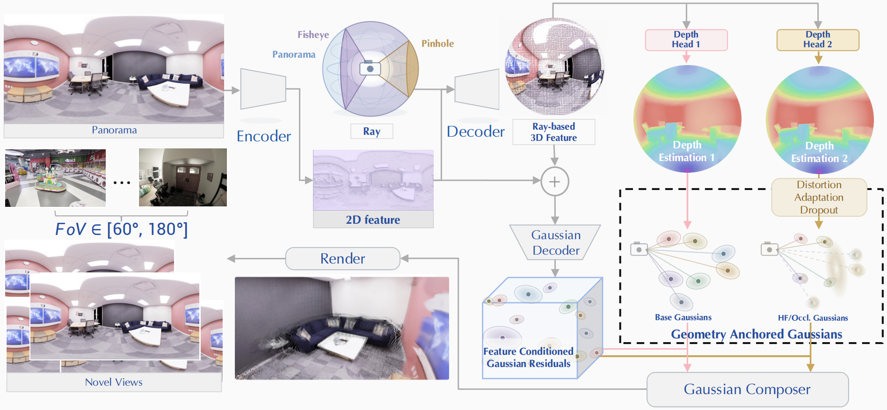
</p>

## 🔨 Installation

Clone this repository and enter the project directory:

```bash
git clone https://github.com/Insta360-Research-Team/UniSHARP.git
cd Unisharp
```

Create a fresh conda environment:

```bash
conda create -n unisharp python=3.12 -y
conda activate unisharp
```

Install PyTorch for your CUDA version. The code was smoke-tested with PyTorch 2.8 and torchvision 0.23:

```bash
pip install torch==2.8.0 torchvision==0.23.0 torchaudio==2.8.0
```

Install the remaining Python dependencies:

```bash
pip install -r requirements.txt
```

## 🧩 External Dependencies

### UniK3D

UniSHARP uses UniK3D for universal camera ray and feature prediction. Clone the official repository into `Unisharp/UniK3D`:

```bash
git clone https://github.com/lpiccinelli-eth/UniK3D.git UniK3D
```

### 3DGEER

Fisheye rendering depends on the GEER CUDA rasterizer from 3DGEER. Clone the repository into `Unisharp/3dgeer`:

```bash
git clone https://github.com/boschresearch/3dgeer.git 3dgeer
```

If you only use perspective or panoramic inference, the GEER rasterizer may not be needed. It is required for fisheye rendering paths.

## 🖼️ Dataset

The released dataset is hosted on Hugging Face:

- Dataset: [Insta360-Research/OmniRooms](https://huggingface.co/datasets/Insta360-Research/OmniRooms)
- Training manifests: [Insta360-Research/OmniRooms/manifests/train](https://huggingface.co/datasets/Insta360-Research/OmniRooms/tree/main/manifests/train)
- Validation manifests: [Insta360-Research/OmniRooms/manifests/validation](https://huggingface.co/datasets/Insta360-Research/OmniRooms/tree/main/manifests/validation)

**OmniRooms** is a panoramic simulation dataset highly suitable for 3D reconstruction, especially for 3DGS tasks. It consists of 16 large indoor scenes, each containing multiple rooms, and 300k RGB images covering both small and large pose movements with corresponding depth information. OmniRooms is collected via AirSim, with **OmniRooms-Wide** derived by projecting these panoramas into 130-degree equidistant fisheye views. For each anchor point on a 0.5 m voxel grid, we render one central camera and 29 cameras randomly sampled within a local axis-aligned 30 cm cube centered on the source camera. To isolate translation-induced synthesis, all cameras share a fixed orientation. Each frame is rendered as a 1024 x 2048 ERP image.

<p align="center">
  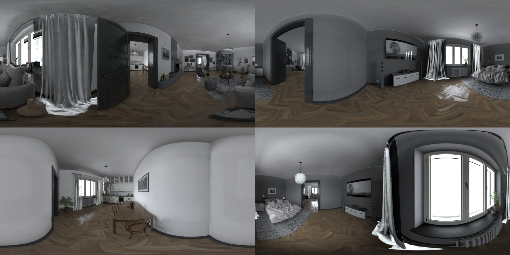
  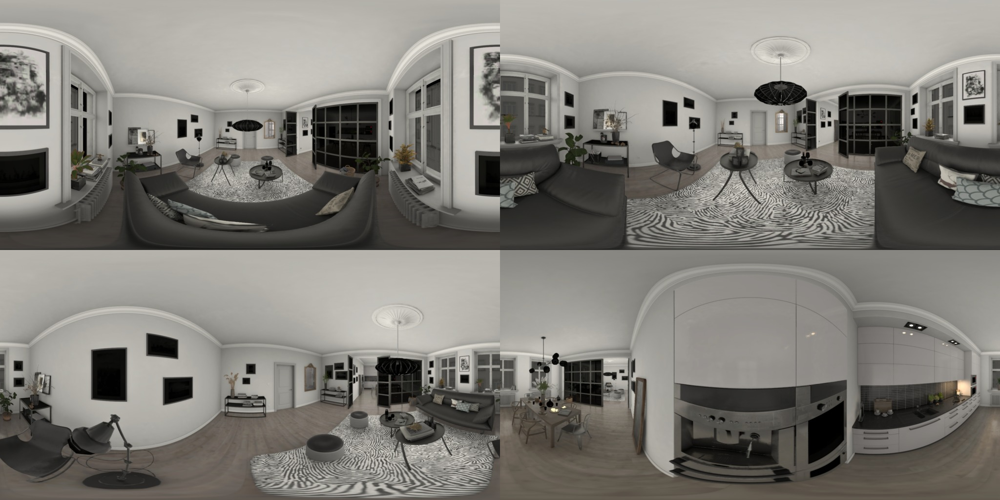
  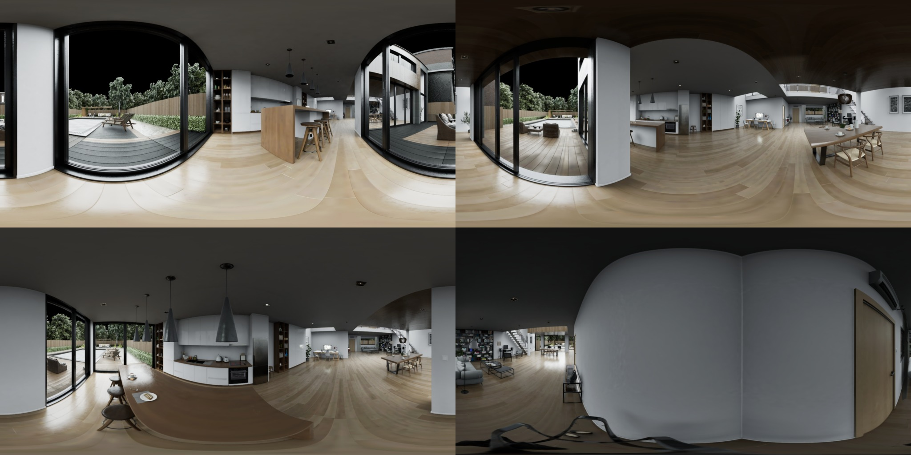
  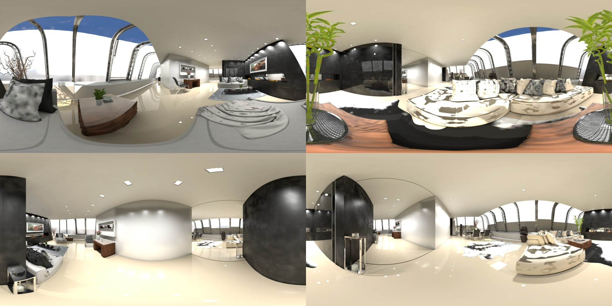
  <br>
  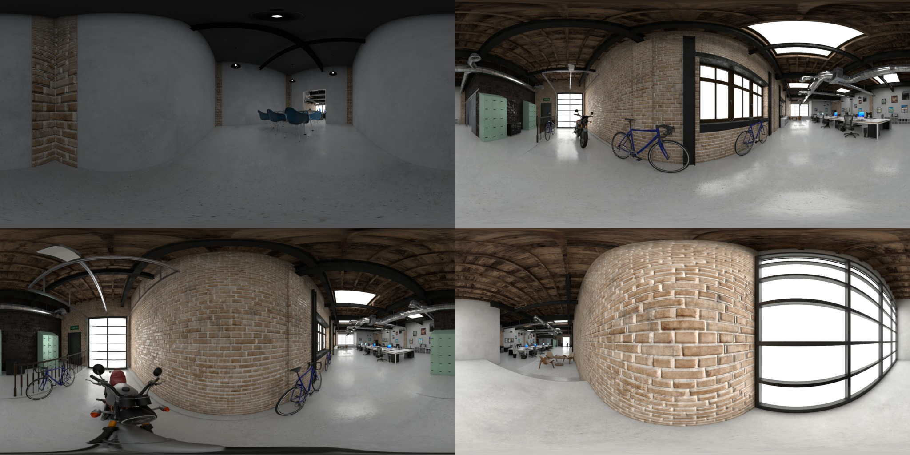
  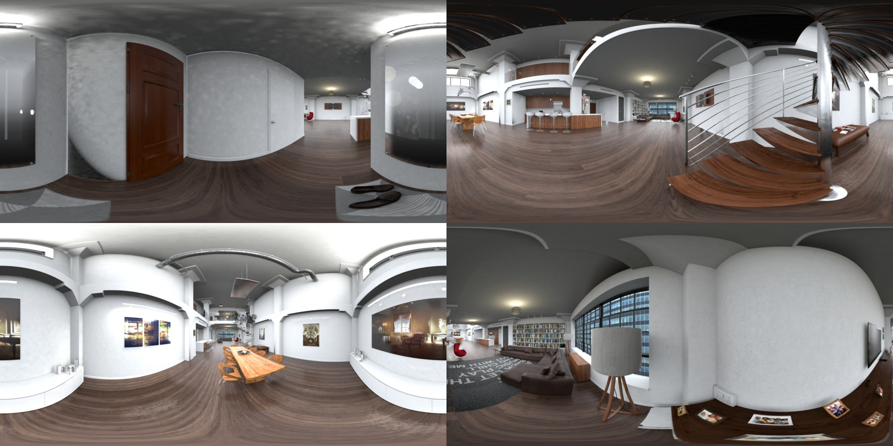
  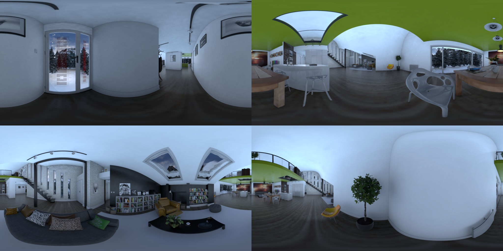
  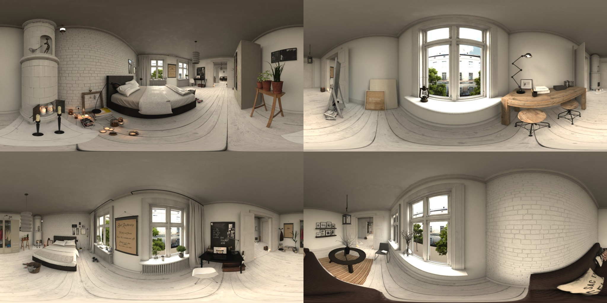
  <br>
  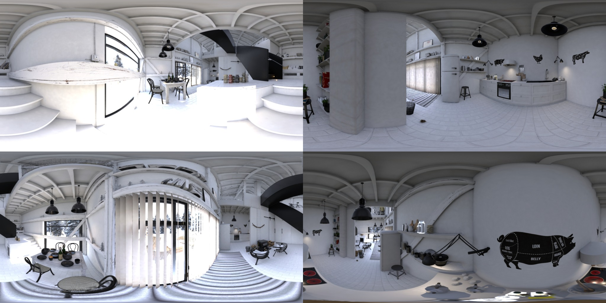
  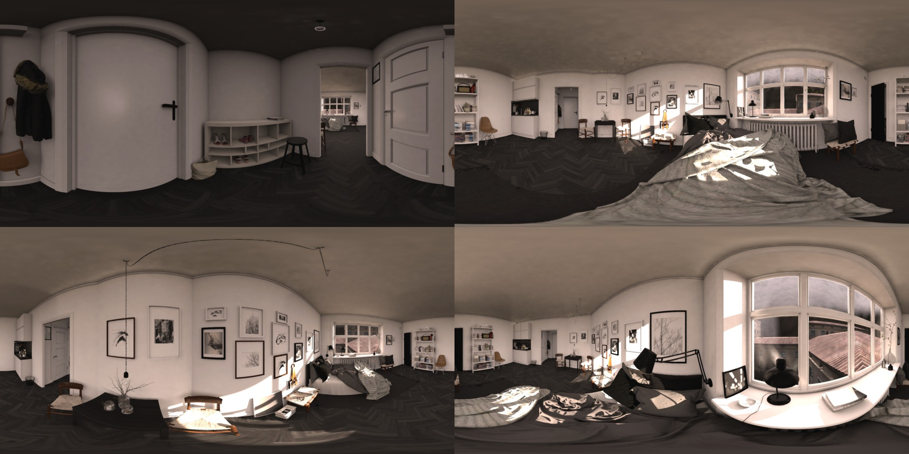
  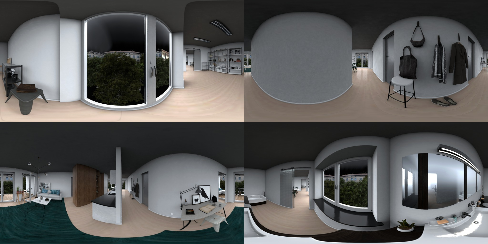
  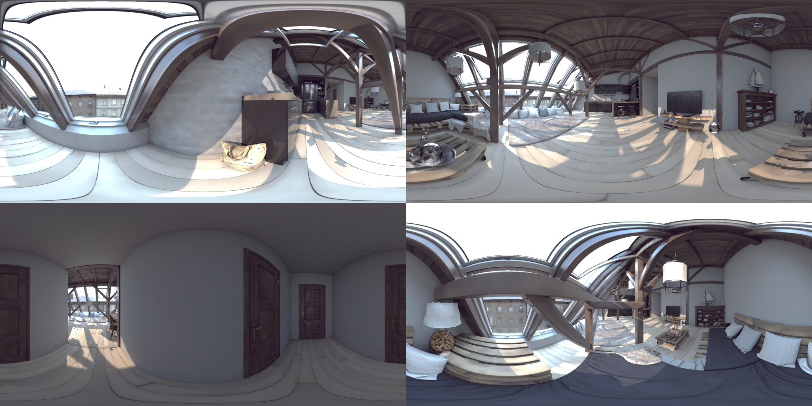
  <br>
  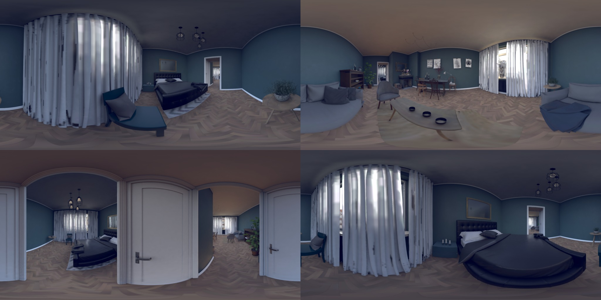
  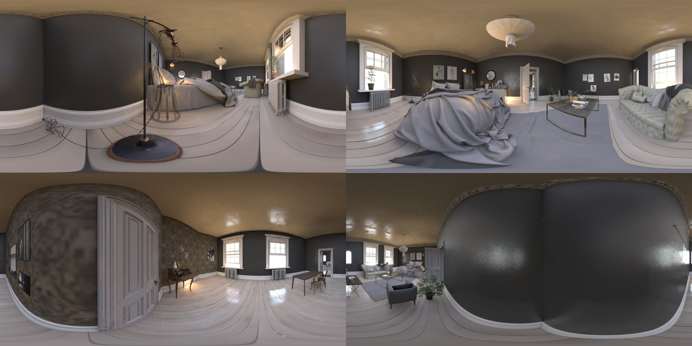
  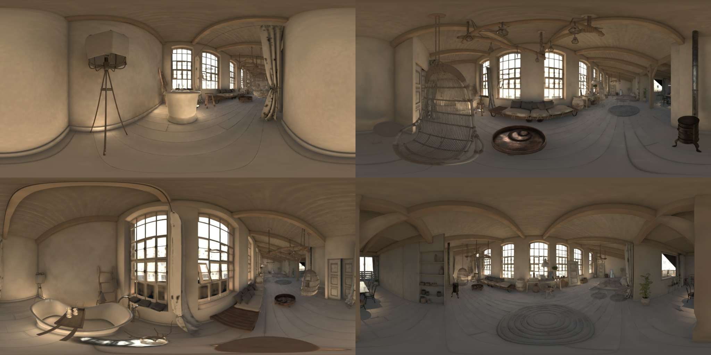
  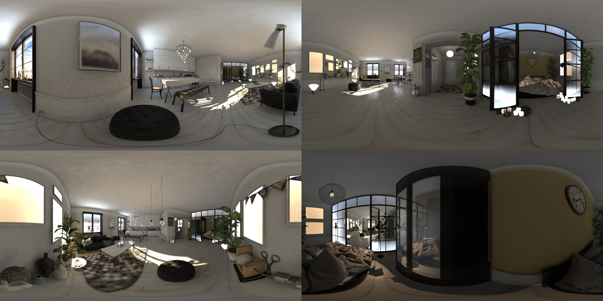
</p>

The code supports the following data sources and manifest aliases:

- `RealEstate10K`
- `HM3D`
- `OmniRooms`
- `OmniRooms-Wide`
- `WildRGB-D`
- `DL3DV` 
- `ScanNet++ Fisheye`
- `Replica`, and `Tanks and Temples` for validation-only protocols

Training manifests use the names released under `manifests/train`:

```text
dataset_manifests/
├── re10k_train_chunks.txt            
├── hm3d_train_scenes.txt            
├── omnirooms.txt              
├── wildrgbd_train_scenes.txt         
├── dl3dv_train_scenes.txt            
└── scanetpp_fisheye_train_scenes.txt 
```

Validation manifests use the names released under `manifests/validation`:

```text
validation_manifests/
├── re10k.txt                      
├── dl3dv.txt                         
├── hm3d.txt                          
├── omnirooms.txt                      
├── omnirooms_wide.txt              
├── wildrgbd.txt                     
├── scanetpp_fisheye.txt              
├── replica.txt                       
├── tat.txt                           
```

## 🤝 Checkpoints

Training starts UniSHARP heads from scratch and loads the original pretrained UniK3D weights through the UniK3D loader. The official launcher does not resume from a previous UniSHARP checkpoint by default.

Released UniSHARP checkpoints are available at [Insta360-Research/Unisharp](https://huggingface.co/Insta360-Research/Unisharp/tree/main). Place a checkpoint anywhere on disk and pass the path to validation or inference:

```bash
CHECKPOINT=/path/to/pretained_model.pt
```

## 🚀 Training

Use the official gt-override training launcher:

```bash
bash scripts/train.sh
```

Training outputs are saved under:

```text
outputs/<run_name>/
├── config.json
├── losses.csv
├── step_XXXXXXX.pt
└── vis/
```

## 📊 Validation

Run validation with a checkpoint:

```bash
bash scripts/validate_unisharp.sh /path/to/step_XXXXXXX.pt
```

## 📒 Inference

Run single-image inference:

```bash
python scripts/infer_unisharp.py \
  --checkpoint /path/to/step_XXXXXXX.pt \
  --image /path/to/image.jpg \
  --out-dir outputs/inference
```

Run a directory or image list:

```bash
python scripts/infer_unisharp.py \
  --checkpoint /path/to/step_XXXXXXX.pt \
  --image-dir /path/to/images \
  --out-dir outputs/inference
```

If calibrated camera parameters are available, pass them through a JSON file. Without this file, the script predicts rays with UniK3D and fits the camera parameters automatically.

Example perspective camera JSON:

```json
{
  "camera": "perspective",
  "intrinsics": {
    "fx": 820.0,
    "fy": 820.0,
    "cx": 512.0,
    "cy": 384.0
  }
}
```

```bash
python scripts/infer_unisharp.py \
  --checkpoint /path/to/step_XXXXXXX.pt \
  --image /path/to/perspective.jpg \
  --camera-json /path/to/perspective_camera.json
```

Example Fisheye624 camera JSON:

```json
{
  "camera": "fisheye",
  "camera_params": [820.0, 820.0, 512.0, 384.0, 0.01, -0.001, 0.0, 0.0]
}
```

```bash
python scripts/infer_unisharp.py \
  --checkpoint /path/to/step_XXXXXXX.pt \
  --image /path/to/fisheye.jpg \
  --camera-json /path/to/fisheye_camera.json
```

For batched inference, the JSON can also contain per-image entries:

```json
{
  "default": {
    "camera": "perspective",
    "intrinsics": [820.0, 820.0, 512.0, 384.0]
  },
  "images": {
    "panorama.jpg": {
      "camera": "panorama"
    },
    "fisheye.jpg": {
      "camera": "fisheye",
      "camera_params": [820.0, 820.0, 512.0, 384.0, 0.01, -0.001, 0.0, 0.0]
    }
  }
}
```


## 🙏 Acknowledgement

This project builds on open-source work from:

- [SHARP](https://github.com/apple/ml-sharp) for monocular Gaussian view synthesis
- [UniK3D](https://github.com/lpiccinelli-eth/UniK3D) for universal camera geometry and features
- [3DGEER](https://github.com/boschresearch/3dgeer) for generic-camera Gaussian rasterization
- [gsplat](https://github.com/nerfstudio-project/gsplat) for Gaussian splatting utilities

## 📝 Citation

```bibtex
@article{song2026unisharp,
  title={UniSHARP: Universal Sharp Monocular View Synthesis},
  author={Song, Meixi and Zhang, Dizhe and Ren, Hao and Zhang, Ruiyang and Du, Bo and Yang, Ming-Hsuan and Qi, Lu},
  journal={arXiv},
  year={2026}
}
```
